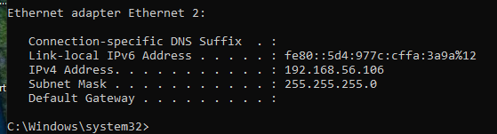
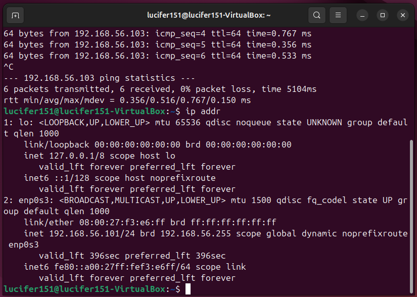
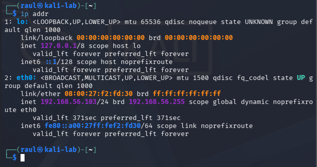
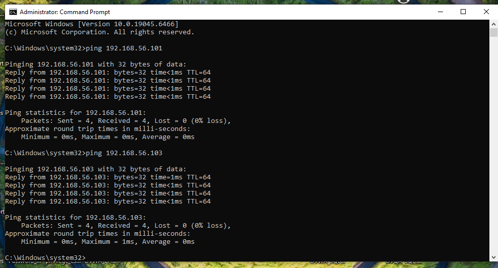

# Multi-OS Network Lab


## 👤 About Me

IT student focused on system administration, networking, and cybersecurity. This repository serves as a hands-on lab portfolio demonstrating real-world technical skills through a self-built virtual environment.

## 👨‍💻 IT & Cybersecurity Lab Portfolio

A structured, hands-on virtual lab environment demonstrating real-world skills in Linux administration, networking, system security, and troubleshooting.

This repository is designed as a progressive learning portfolio simulating enterprise IT and cybersecurity environments using VirtualBox.

## Featured Labs

This repository currently includes the following completed hands-on projects:

- 🛠️ Network Troubleshooting Lab – Diagnosed and resolved virtual machine networking issues within a VirtualBox Host-Only environment.
- 🔐 SSH Administration Lab – Configured secure remote administration between Ubuntu and Kali Linux using OpenSSH.
- 🌐 Nmap Network Discovery Lab – Performed host discovery, port scanning, and service enumeration.
- 📡 Wireshark Traffic Analysis Lab – Captured and analyzed ICMP, TCP, SSH, and network scanning traffic using Wireshark.
- 🐧 Linux Permissions Lab – Configured Linux users, groups, shared directories, and file permissions to demonstrate secure access control.
- 🔥 UFW Firewall Configuration Lab – Configured and tested Ubuntu's Uncomplicated Firewall (UFW), created allow/deny rules, and validated firewall behavior using SSH and Nmap.

## Overview

This repository documents my personal IT home lab environment built using virtual machines running Windows, Ubuntu, and Kali Linux.

The purpose of this lab is to develop skills in:

- Windows Administration
- Linux Administration
- Networking
- Virtualization
- SSH Remote Access
- System Troubleshooting
- Security Fundamentals
- Cross-Platform Integration

---

## 🎯 Technical Focus Areas

This lab environment focuses on building practical skills in:

- Linux System Administration (Ubuntu)
- Network Configuration & Troubleshooting (TCP/IP, ICMP)
- Security Fundamentals (Permissions, Firewalls, Access Control)
- Remote Administration (SSH)
- Network Analysis (Wireshark, Nmap)
- Virtualization & Lab Infrastructure (VirtualBox)
- Basic Defensive Security Practices

---

## 📘 Lab Structure Overview

Each lab in this repository follows a professional documentation structure:

- Clear objectives and lab goals
- Step-by-step command execution
- Real-world troubleshooting scenarios
- Security analysis and observations
- Screenshots as evidence of execution
- Technical explanations of outcomes
- Skills mapping to enterprise IT concepts

---

## Table of Contents

- [Overview](#overview)
- [What You'll Find](#what-youll-find)
- [Lab Environment](#lab-environment)
- [Technologies Used](#technologies-used)
- [Project Goals](#project-goals)
- [Network Configuration](#network-configuration)
- [Skills Demonstrated](#skills-demonstrated)
- [Key Achievements](#key-achievements)
- [Portfolio Highlights](#portfolio-highlights)
- [Lab Statistics](#lab-statistics)
- [Lab Progress](#lab-progress)
- [Repository Structure](#repository-structure)
- [Documentation](#documentation)
- [Evidence](#evidence)
- [Project Status](#project-status)
- [Summary](#summary)

## Lab Environment

| Operating System | Purpose |
|-----------------|----------|
| Windows 11 | Administration, connectivity testing, and traffic generation |
| Ubuntu Linux | SSH server and Linux system administration |
| Kali Linux | Network discovery, packet analysis, and security testing |

---

## Technologies Used

- VirtualBox
- Windows 11
- Ubuntu Linux
- Kali Linux
- OpenSSH Server
- Nmap
- Wireshark
- UFW (Uncomplicated Firewall)
- Bash
- Linux User Management
- chmod
- chown
- useradd
- usermod
- Git
- GitHub

---

## Tools Used in This Lab Series

- VirtualBox (virtual machine networking and isolation)
- Linux Terminal (Ubuntu + Kali)
- Windows Command Prompt / IP configuration tools
- OpenSSH (secure remote access)
- Nmap (network discovery and scanning)
- Wireshark (packet capture and analysis)
- Ping / ICMP troubleshooting
- Linux user and group management utilities (useradd, usermod, groupadd, chmod, chown)
- UFW (host-based firewall management)

---

## Project Goals

- Configure communication between multiple operating systems
- Practice troubleshooting network and system issues
- Implement secure remote administration using SSH
- Perform network discovery and service enumeration
- Capture and analyze network traffic
- Document findings using professional technical documentation

---

## 🗺️ Lab Roadmap

This roadmap outlines completed, current, and planned technical labs in this repository.

### ✅ Completed Labs
- Network Troubleshooting (Host-Only VirtualBox Networking)
- SSH Administration (Remote Linux Access)
- Nmap Network Discovery (Port Scanning & Enumeration)
- Wireshark Traffic Analysis (Packet Capture & Inspection)
- Linux Permissions (Users, Groups, and Access Control)
- UFW Firewall Configuration (Host-Based Firewall Rules)

### 🔧 In Progress Labs
- Apache Web Server Deployment (Linux Service Hosting)
- Linux Log Analysis (System and Security Logs)
- DNS Troubleshooting and Resolution Analysis

### 🚀 Planned Advanced Labs
- Metasploitable 2 Vulnerability Testing
- Active Directory Lab (Windows Domain Environment)
- SIEM Log Forwarding and Analysis
- Linux Hardening and Security Baselines
- Incident Response Simulation Lab

---

## Network Configuration

All virtual machines are connected using a Host-Only Adapter in VirtualBox to provide isolated communication between systems.

## Network Architecture

All virtual machines communicate through a VirtualBox Host-Only network, creating an isolated internal environment for safe testing of networking, system administration, and security tools without external network exposure.

---

## 🏗️ Lab Architecture Overview

This environment simulates a small enterprise-style network using VirtualBox Host-Only networking.

```text
                 [ Windows 11 ]
                       |
                       |  ICMP / TCP / SSH / Nmap
                       |
        -----------------------------------------
        |                                       |
[ Ubuntu Server ] ------------------- [ Kali Linux ]
   SSH Server        Logs + Firewall     Security Testing

Key Design Principles
- Isolated internal network (Host-Only)
- No external internet dependency for testing
- Simulated attacker (Kali) and server (Ubuntu)
- Windows used for traffic generation and testing

```
---

```markdown
## 🧪 Lab Methodology Standard

Each lab in this repository follows a consistent structure:

1. Objective Definition
2. Environment Setup
3. Tool Selection
4. Command Execution
5. Packet or System Analysis
6. Screenshot Evidence Collection
7. Troubleshooting (if applicable)
8. Security Observations
9. Real-World Application
10. Conclusion and Skills Summary

```

---

### Current IP Addresses

| System | IP Address |
|----------|----------|
| Windows 11 | 192.168.56.106 |
| Ubuntu Linux | 192.168.56.101 |
| Kali Linux | 192.168.56.104 |

---

## Skills Demonstrated

- Virtual machine configuration
- TCP/IP networking
- Host-Only network configuration
- Network troubleshooting
- Linux command-line administration
- Linux user management
- Linux group management
- Linux file permissions and access control
- Windows system administration
- SSH remote administration
- Network discovery with Nmap
- Packet capture and analysis using Wireshark
- Technical documentation
- Cybersecurity fundamentals
- Linux firewall administration
- UFW configuration
- Network access control

---

## 📊 Skills Matrix

This matrix maps completed labs to the technical skills they demonstrate.

| Skill Area | Labs |
|------------|------|
| Linux Administration | Permissions Lab, UFW Lab, SSH Lab |
| Networking Fundamentals | Network Troubleshooting, Nmap Lab |
| Packet Analysis | Wireshark Traffic Analysis |
| Security Fundamentals | UFW Firewall Lab, Permissions Lab |
| Remote Access | SSH Administration Lab |
| System Troubleshooting | Network Troubleshooting Lab |
| Network Scanning | Nmap Discovery Lab |
| Traffic Inspection | Wireshark Lab |
| User & Group Management | Linux Permissions Lab |
| Firewall Configuration | UFW Firewall Lab |

---

## Key Achievements

- Built a multi-VM isolated network environment using VirtualBox
- Successfully implemented SSH remote administration between Linux systems
- Performed network discovery and port scanning using Nmap
- Captured and analyzed real network traffic using Wireshark
- Resolved network connectivity issues through systematic troubleshooting
- Configured secure Linux file permissions using users, groups, and shared directories
- Configured and verified host-based firewall rules using UFW

---

## Portfolio Highlights

This repository contains hands-on IT and cybersecurity labs built inside a self-hosted virtual environment. Each project emphasizes practical administration, troubleshooting, networking, and security skills commonly used in enterprise environments.

- Linux system administration
- SSH remote administration
- TCP/IP networking
- Network troubleshooting
- Nmap network discovery
- Wireshark packet analysis
- Linux users, groups, and permissions
- Technical documentation
- Linux firewall configuration using UFW

---

## Lab Statistics

- 🖥️ **3 Virtual Machines**
- 📄 **6 Completed Labs**
- 📸 **50+ Screenshots**
- 💻 **140+ Linux & Windows Commands Executed**
- 🔒 **SSH Remote Administration**
- 🌐 **TCP/IP Networking**
- 🔍 **Nmap Network Discovery**
- 📡 **Wireshark Packet Analysis**

---

## Lab Progress

| Lab | Status |
|-----|--------|
| Network Troubleshooting | ✅ Completed |
| SSH Administration | ✅ Completed |
| Nmap Network Discovery | ✅ Completed |
| Wireshark Traffic Analysis | ✅ Completed |
| Linux Permissions | ✅ Completed |
| UFW Firewall Configuration | ✅ Completed |

---

## Repository Structure

```text
multi-os-network-lab/
├── README.md
├── documentation/
│   ├── linux-permissions-lab.md
│   ├── network-troubleshooting-log.md
│   ├── nmap-network-discovery-lab.md
│   ├── ssh-administration-lab.md
│   ├── ufw-firewall-lab.md
│   └── wireshark-traffic-analysis-lab.md
└── screenshots/
    ├── linux-permissions/
    ├── networking/
    ├── nmap/
    ├── ssh/
    ├── ufw/
    └── wireshark/
```

---

## Documentation

### Completed Labs

- [Network Troubleshooting Log](documentation/network-troubleshooting-log.md)
- [SSH Administration Lab](documentation/ssh-administration-lab.md)
- [Nmap Network Discovery Lab](documentation/nmap-network-discovery-lab.md)
- [Wireshark Traffic Analysis Lab](documentation/wireshark-traffic-analysis-lab.md)
- [Linux Permissions Lab](documentation/Linux-Permissions-Lab.md)
- [UFW Firewall Configuration Lab](documentation/ufw-firewall-configuration-lab.md)

---

## Evidence

### Network Configuration

#### Windows IP Configuration


#### Ubuntu IP Configuration


#### Kali IP Configuration


#### Network Connectivity Test


---

## Project Status

### Completed

- Multi-VM environment deployment
- Host-Only network configuration
- Cross-platform connectivity validation
- Network troubleshooting
- SSH remote administration
- Network discovery using Nmap
- Packet capture and analysis using Wireshark
- Linux user and group management
- Linux file permissions and access control
- Linux firewall configuration using UFW

---

### Currently Building

- Apache Web Server
- Linux Log Analysis
- DNS Troubleshooting

---

### Planned Future Labs

- Apache Web Server Deployment
- DNS Traffic Analysis
- System Log Analysis
- Vulnerability Scanning
- Metasploitable 2 Integration
- Active Directory Lab

---

## 🧾 Documentation Standards

All labs in this repository follow structured technical documentation practices similar to enterprise IT environments.

Each lab includes:

- Reproducible command sequences
- Verified system outputs
- Annotated screenshots
- Security impact explanations
- Troubleshooting documentation
- Real-world application context

---

## 🧾 Summary

This repository serves as a structured IT and cybersecurity lab portfolio demonstrating hands-on experience with Linux systems, networking, security tools, and virtualization.

Built using a multi-VM environment (Windows 11, Ubuntu Linux, and Kali Linux), this lab simulates real-world enterprise scenarios including system administration, network troubleshooting, and security analysis.

The environment simulates real-world IT and cybersecurity infrastructure, including secure remote access, firewall configuration, packet analysis, and network troubleshooting.

Core technologies used include:
- Linux system administration (users, groups, permissions, services)
- Network analysis tools (Wireshark, Nmap)
- Secure remote administration (SSH)
- Host-based firewall configuration (UFW)
- TCP/IP networking and troubleshooting

Each lab is fully documented with structured methodology, commands, screenshots, and technical explanations aligned with real enterprise documentation practices.

This environment was built and maintained using VirtualBox to simulate enterprise-style network segmentation, security controls, and system administration workflows commonly found in production IT environments.

## 🚀 Professional Value

This repository demonstrates:
- Practical system administration experience
- Network and security troubleshooting skills
- Ability to document technical processes clearly
- Understanding of enterprise-style network environments
- Progressive skill development across multiple IT domains

This project continues to evolve as additional labs are added, including web services, Active Directory environments, vulnerability testing, and security monitoring systems.

---

## About This Repository

This repository is actively maintained as part of my ongoing professional development in information technology and cybersecurity. New labs, documentation, and screenshots will be added as additional technologies and administrative tasks are explored.

If you're reviewing this portfolio, thank you for taking the time to explore my work.
