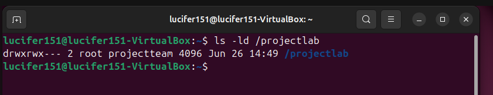
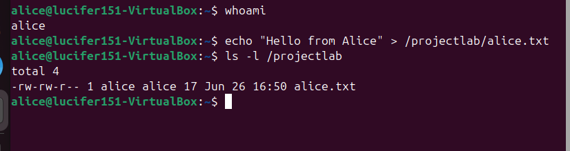
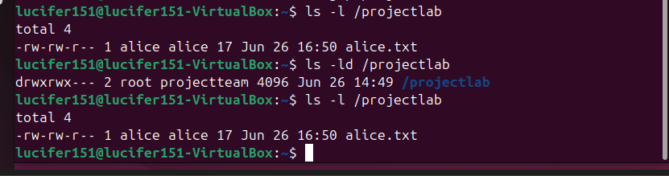
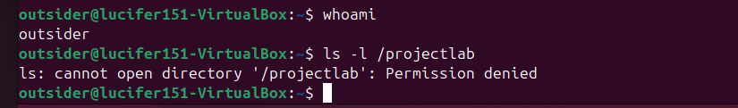

# 🐧 Linux Permissions Lab

## Objective

The objective of this lab was to configure and validate Linux file permissions using users, groups, and shared directories. This lab demonstrates how Linux enforces access control through ownership and permission bits, and how group membership enables secure collaboration between multiple users in a shared environment.

---

## Lab Environment

This lab was conducted in an Ubuntu Linux virtual machine running inside VirtualBox with a Host-Only network configuration.

| User | Role |
|------|------|
| alice | Standard user |
| bob | Standard user |
| outsider | Standard user (not in projectteam group) |
| root | System administrator |

| Group | Purpose |
|-------|--------|
| projectteam | Shared collaboration group |

---

## Technologies Used

- Ubuntu Linux
- Bash shell
- User management tools (`useradd`, `usermod`)
- Group management (`groupadd`)
- File and directory permissions (`chmod`, `chown`)
- Linux access control model

---

## Methodology

1. Create a shared group for controlled access
2. Create a secured shared directory
3. Configure ownership and permissions
4. Add users to the group
5. Test file creation and access between users
6. Verify permission behavior and troubleshoot issues
7. Validate permission behavior

---

## Step 1: Create Group

```bash
sudo groupadd projectteam
```
## Step 2: Create Shared Directory

```bash
sudo mkdir /projectlab
```
## Step 3: Configure Ownership and Permissions

```bash
sudo chown root:projecctteam /projectlab
sudo chmod 770 /projectlab
```
### Permission Breakdown
- Owner (root): read, write, execute
- Group (projectteam): read, write, execute
- Others: no access
This ensures only authorized users can access the directory

## Step 4: Add Users to Group

```bash
sudo usermod -aG projectteam alice
sudo usermod -aG projectteam bob
```
⚠️ Users must log out and log back in (or reboot) for changes to apply.

## Step 5: File Creation and Testing

```bash
echo "Hello from Alice" > /projectlab/alice.txt
```
Directory contents were verified:

```bash
ls -l /projectlab
```

## Step 6: Verify Unauthorized Access

The `outsider` user was intentionally excluded from the **projectteam** group to verify that Linux permissions prevent unauthorized access.

```bash
su - outsider
cd /projectlab

```

## Evidence



*Figure 1. The `/projectlab` directory configured with `770` permissions and assigned to the `projectteam` group.*

---

### Alice File Creation



*Figure 2. User **alice** successfully creates a file inside the shared directory.*

---

### Shared File Access


*Figure 3. User **Bob** accesses the shared file created by **alice**, demonstrating correct group permissions.*

---

### Directory Listing



*Figure 4. Output of `ls -l /projectlab` showing ownership, group assignment, and file permissions.*

---

### Unauthorized Access Attempt



*Figure 5. The **outsider** user attempts to access `/projectlab` but receives a **Permission denied** error because the user is not a member of the `projectteam` group.*

---

## Key Findings

- Linux uses user, group, and others for access control
- Group membership enables secure collaboration
- Permission mode 770 restricts access to authorized users only
- Directory execute (x) permission is required to access contents
- Group membership changes require session refresh
- Unauthorized users were prevented from accessing the shared directory

---

## Security Observations

- Proper permissions prevent unauthorized file access
- Group-based access control supports secure collaboration
- Linux enforces strong built-in security through permissions
- Least privilege principles improve system security
- Linux enforces access restrictions based on group membership

---

## Troubleshooting Summary

### Issue: Cannot list directory contents

ls -l /projectlab initially failed.

**Cause:**

Group membership was not applied in the active session.

**Resolution:**
- Verified group membership
- Logged out and back in
- Confirmed access to /projectlab

---

## Real-World Relevance

Linux permissions are widely used in:

- Enterprise file servers
- Multi-user Linux systems
- Cloud environments
- Web hosting platforms
- Cybersecurity systems

Understanding permissions is essential for system administration and security roles.

---

## Conclusion

This lab demonstrated Linux file permissions, group management, and secure shared directory configuration. It showed how Linux enforces access control through ownership and permission bits while enabling controlled collaboration between multiple users.

---

## Skills Demonstrated

- Linux user management
- Linux group management
- File and directory permissions
- Secure shared directory configuration
- Linux command-line administration
- Access control troubleshooting
- Multi-user system administration
