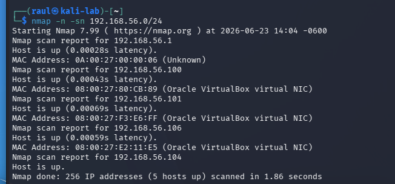
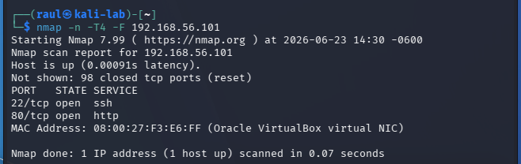
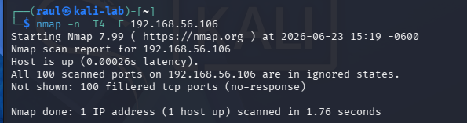
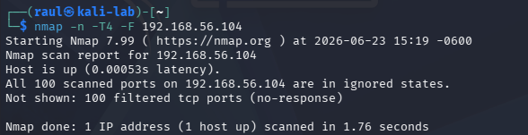

# Nmap Network Discovery Lab

## Objective

The objective of this lab was to perform network discovery and service enumeration across a multi-virtual machine environment using Nmap. The lab focuses on identifying live hosts, analyzing open ports, and understanding service exposure within a controlled Host-Only VirtualBox network.

---

## Lab Environment

All virtual machines are connected using a VirtualBox Host-Only network to simulate an isolated internal network.

| System | Role | IP Address |
|--------|------|------------|
| Windows 11 | Workstation | 192.168.56.106 |
| Ubuntu Linux | Server (SSH enabled) | 192.168.56.101 |
| Kali Linux | Security Testing Machine | 192.168.56.104 |

---

## Technologies Used

- VirtualBox
- Kali Linux
- Ubuntu Linux
- Windows 11
- Nmap
- TCP/IP Networking
- ICMP (Ping)
- SSH (OpenSSH Server)

---

## Methodology

The following steps were used to perform network discovery and service enumeration:

1. Identify live hosts using Nmap ping scan
2. Perform TCP SYN scans on target systems
3. Identify open ports and services
4. Analyze service versions where applicable
5. Validate connectivity between virtual machines

---

## Network Discovery Scan

### Host Discovery Command

```bash
nmap -n -sn 192.168.56.0/24
```

### Observed Live Hosts

- 192.168.56.101 → Ubuntu Linux
- 192.168.56.104 → Kali Linux
- 192.168.56.106 → Windows 11
- 192.168.56.1 → VirtualBox Host-Only Gateway
- 192.168.56.100 → VirtualBox/DHCP artifact

---

## Service and Port Scanning

### Ubuntu Linux (192.168.56.101)

```bash
nmap -n -T4 -F 192.168.56.101
```

**Results:**
- Port 22/tcp → Open (SSH)

---

### Windows 11 (192.168.56.106)

```bash
nmap -n -T4 -F 192.168.56.106
```

**Results:**
- Port 445/tcp → Filtered (SMB blocked by firewall)
- Other ports → Closed or filtered

---

### Kali Linux (192.168.56.104)

```bash
nmap -n -T4 -F 192.168.56.104
```

**Results:**
- Host responded successfully
- Services were identified according to scan output

---

## Key Findings

- All virtual machines successfully communicate within the Host-Only network
- Ubuntu exposes SSH service (port 22) for remote administration
- Windows system filters SMB traffic (port 445), likely due to firewall configuration
-  Kali Linux successfully performs both local and remote scans after VirtualBox restart, with no persistent issues observed.

---

## Evidence Section

### Network Discovery Scan


### Ubuntu Service Enumeration


### Windows Service Enumeration


### Kali Service Enumeration



## Troubleshooting Summary

### Issue 1: Excessive Host Discovery Results

Initial scans showed additional IPs (.1 and .100). These were identified as VirtualBox Host-Only gateway and DHCP-related artifacts, not active lab machines.

---

### Issue 2: Inconsistent Nmap Scan Results

During testing, Nmap scans against Kali Linux and Windows 11 intermittently reported hosts as unavailable or experienced significant delays.

Investigation:
- Verified IP connectivity using ping.
- Confirmed all systems were on the same Host-Only network.
- Verified correct IP assignments.

Resolution:
- Shut down all virtual machines.
- Closed and restarted VirtualBox.
- Restarted all virtual machines.
- Re-ran Nmap scans.

Result:
All hosts responded normally after VirtualBox was restarted, indicating a temporary virtualization networking issue.

---

### Issue 3: DNS Resolution Warnings

Inverse host lookup and DNS warnings occurred during scanning.

**Resolution:**
Disabled DNS resolution during scans using:

```bash
nmap -n
```

---

## Skills Demonstrated

- Network Discovery
- Service Enumeration
- Virtual Network Analysis
- Linux Command Line Usage
- Windows Service Analysis
- Cybersecurity Reconnaissance Techniques
- Troubleshooting Virtualized Environments
- TCP/IP Networking Fundamentals

---

## Security Observations

- SSH (port 22) provides secure remote administration on Ubuntu
- Windows SMB service is not publicly exposed (filtered)
- Network segmentation effectively isolates lab environment
- Host-only configuration prevents external network exposure

---

## Real-World Relevance

This type of network discovery is commonly used in:

- IT system administration for asset discovery
- Cybersecurity reconnaissance and penetration testing
- Network auditing and service inventory management
- Infrastructure security assessments

The lab simulates real-world techniques used by security analysts to identify active hosts and exposed services in enterprise environments.

---

## Conclusion

This lab successfully demonstrated network discovery, service enumeration, and analysis of a multi-operating system virtual environment. Using Nmap, active hosts were identified, services were mapped, and network behavior was analyzed.

The exercise reinforced core skills in networking, system administration, and cybersecurity fundamentals while providing practical experience with industry-standard tools.

---

## Repository Structure

```text
multi-os-network-lab/
├── README.md
├── documentation/
│   ├── network-troubleshooting-log.md
│   ├── ssh-administration-lab.md
│   └── nmap-network-discovery-lab.md
└── screenshots/
    ├── networking/
    ├── ssh/
    └── nmap/
```
