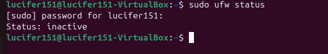
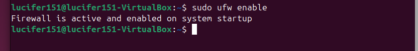
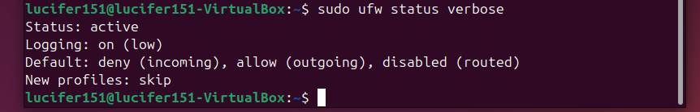
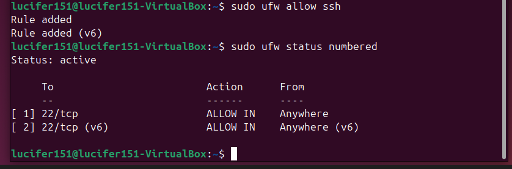
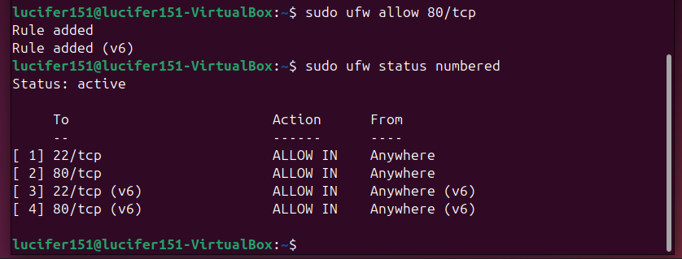
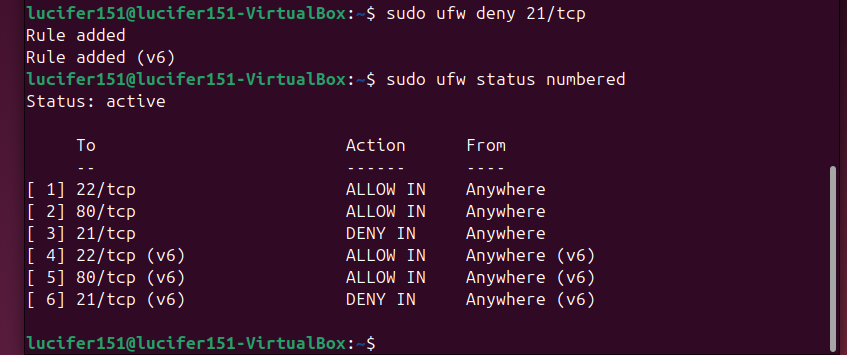
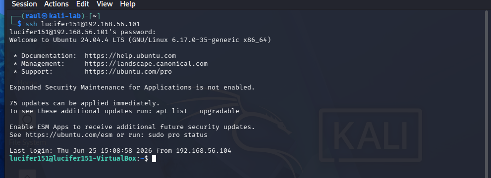
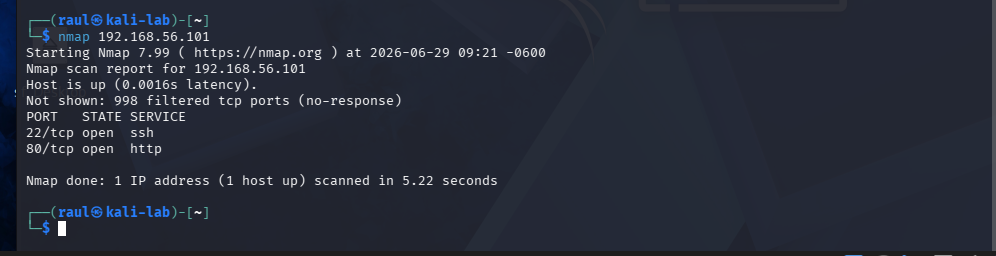
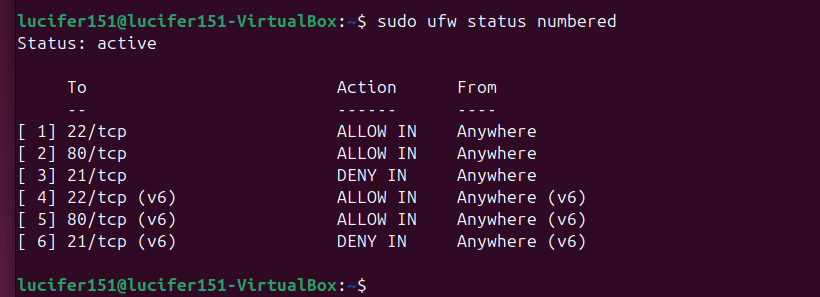

# 🔥 Linux Firewall Configuration (UFW) Lab

## Objective

The objective of this lab was to configure and manage the Ubuntu Uncomplicated Firewall (UFW) to secure a Linux system by controlling inbound network traffic. The lab demonstrates how firewall rules can be used to restrict unauthorized access while allowing approved services such as SSH.

---

## Lab Environment

This lab was conducted using an Ubuntu Linux virtual machine running inside VirtualBox with a Host-Only network configuration.

| System | Role | IP Address |
|---------|------|------------|
| Ubuntu Linux | Firewall Server | 192.168.56.101 |
| Kali Linux | SSH Client / Connectivity Testing | 192.168.56.104 |
| Windows 11 | Additional Network Client | 192.168.56.106 |

---

## Technologies Used

- Ubuntu Linux
- UFW (Uncomplicated Firewall)
- OpenSSH Server
- Bash Shell
- VirtualBox
- TCP/IP Networking

---

## Methodology

1. Verify UFW installation
2. Check current firewall status
3. Enable the firewall
4. Allow SSH traffic
5. Review firewall rules
6. Test SSH connectivity
7. Add additional firewall rules
8. Remove an existing rule
9. Verify final firewall configuration

---

## Step 1: Verify UFW Installation

```bash
sudo ufw version
```

### Observed Results

- Confirmed that UFW was installed and available on the Ubuntu system.

---

## Step 2: Check Firewall Status

```bash
sudo ufw status verbose
```

### Observed Results

- Firewall status displayed as inactive before configuration.
- No active firewall rules were configured.

---

## Step 3: Enable the Firewall

```bash
sudo ufw enable
```

Verify:

```bash
sudo ufw status verbose
```

### Observed Results

- UFW was successfully enabled.
- Default firewall policies became active.

---

## Step 4: Allow SSH Connections

```bash
sudo ufw allow OpenSSH
```

or

```bash
sudo ufw allow 22/tcp
```

Verify:

```bash
sudo ufw status numbered
```

### Observed Results

- SSH traffic was permitted through the firewall.
- Existing SSH connectivity remained functional.

---

## Step 5: Test Remote Access

From the Kali Linux virtual machine:

```bash
ssh lucifer151@192.168.56.101
```

### Observed Results

- SSH connection completed successfully.
- Firewall rules allowed secure remote administration.

---

## Step 6: Add Additional Firewall Rule

Example:

```bash
sudo ufw allow 80/tcp
```

Verify:

```bash
sudo ufw status numbered
```

### Observed Results

- HTTP traffic was added as an allowed service.
- Firewall rules updated successfully.

---

## Step 7: Remove Firewall Rule

List rules:

```bash
sudo ufw status numbered
```

Delete a rule:

```bash
sudo ufw delete 2
```

Verify:

```bash
sudo ufw status
```

### Observed Results

- Selected firewall rule was successfully removed.
- Remaining rules continued protecting the system.

---

## Evidence

### Firewall Status (Inactive)



*Figure 1. Initial UFW status showing that the firewall is inactive before any configuration changes are made.*

---

### UFW Enabled



*Figure 2. UFW enabled successfully, activating the firewall with the default security policies.*

---

### Firewall Status (Active)



*Figure 3. Verification that UFW is active and enforcing firewall rules on the Ubuntu system.*

---

### SSH Rule Configuration



*Figure 4. Firewall rule allowing inbound SSH (TCP port 22) to permit secure remote administration.*

---

### HTTP Rule Configuration



*Figure 5. Firewall rule allowing inbound HTTP (TCP port 80) traffic, demonstrating how additional services can be permitted.*

---

### FTP Rule Denied



*Figure 6. Firewall rule denying inbound FTP (TCP port 21) traffic to restrict access to unnecessary services.*

---

### SSH Connectivity Test



*Figure 7. Successful SSH connection from the Kali Linux virtual machine after enabling UFW and allowing SSH traffic through the firewall.*

---

### Nmap Scan After Firewall Configuration



*Figure 8. Nmap scan performed after firewall configuration, confirming that only the permitted services are accessible.*

---

### Final Firewall Rules



*Figure 9. Final UFW rule set displayed using `ufw status numbered`, showing the active firewall configuration after completing the lab.*

---

## Key Findings

- UFW provides a simple interface for Linux firewall management.
- Firewall rules can allow or deny specific services.
- SSH access remained available after explicitly allowing TCP port 22.
- Firewall rules can be modified without reinstalling or rebooting the system.
- Numbered rules simplify firewall management.

---

## Security Observations

- Firewalls reduce the attack surface of Linux systems.
- Only required services should be allowed.
- SSH should be explicitly permitted before enabling the firewall to prevent accidental lockout.
- Principle of least privilege improves overall system security.
- Regular firewall audits help maintain secure configurations.

---

## Real-World Relevance

Linux firewalls are commonly used in:

- Enterprise Linux servers
- Cloud infrastructure
- Web servers
- Database servers
- Virtual machine environments
- Cybersecurity operations

Firewall administration is a core responsibility for system administrators, network administrators, and cybersecurity professionals.

---

## Conclusion

This lab demonstrated how to configure and manage the Ubuntu Uncomplicated Firewall (UFW) to secure a Linux system. Firewall rules were created, verified, tested, and modified while maintaining secure SSH access. The exercise reinforced fundamental firewall administration concepts used in enterprise Linux environments.

---

## Skills Demonstrated

- Linux firewall administration
- UFW configuration
- Secure remote administration
- Linux command-line management
- Network security
- Firewall rule management
- Access control
- Enterprise Linux administration
